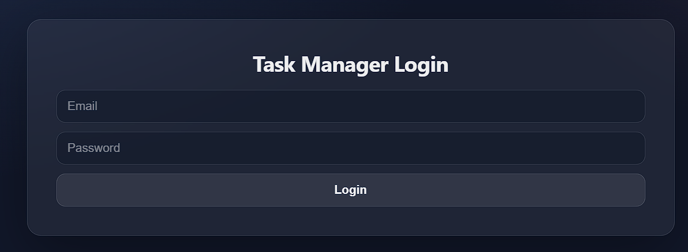
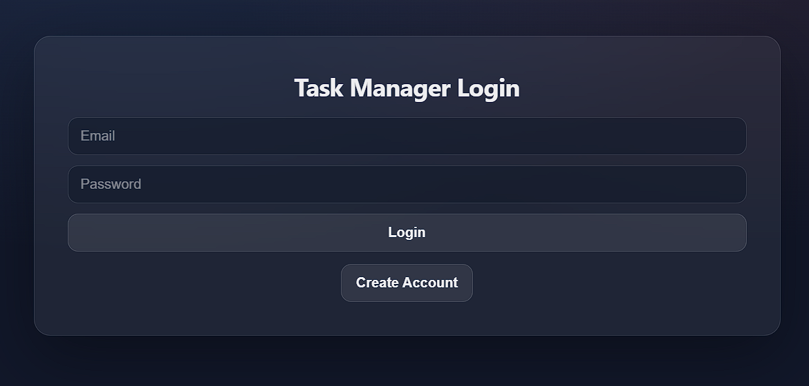

# Task Manager Frontend

Full-stack task manager with JWT auth (login)  + CRUD tasks.

## Features 
- Login (JWT)
- Create / list tasks
- Toggle done/todo
- Delete tasks
- Auto-logout on expired/invalid token

## Tech Stack
**Frontend:** React + Vite
**Backend:** Node.js + Express
**DB:** MongoDB

## Screenshots
### Login


### Dashboard


## Local Setup
### Frontend
```bash
cd frontend
npm install
npm start
